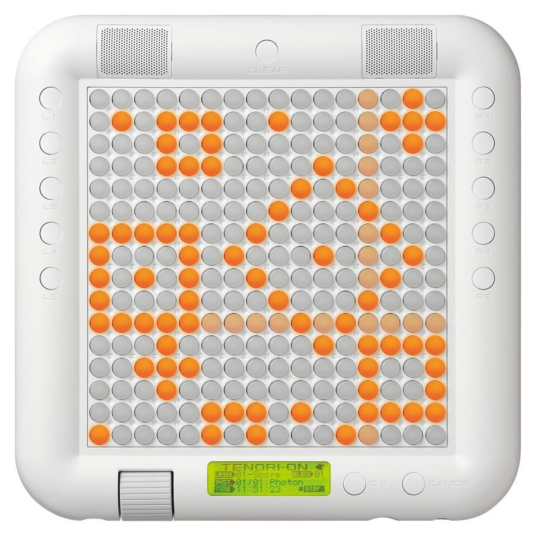

The Tenori-On is a unique synthesizer built by Yamaha. A while ago, a close-up photograph of the device happened to show its LCD interface in great detail. I really enjoyed the pixel typeface that was featured, and after digging around, happened on a manual that showcased more of the interface.

Unfortunately, as I read on, it appeared as though a "complete" version of the alphanumeric character set existed, so I decided to "clone" the font in the manual, and extrapolate the rest of the characters that were not available to me. I decided to go the extra mile and create a unicode-complete typeface, along with stylistic sets for encompassing the two other character styles visible on the synthesizer's interface.

I'll finish this one of these days. It's a project I attend to when I get the time.
